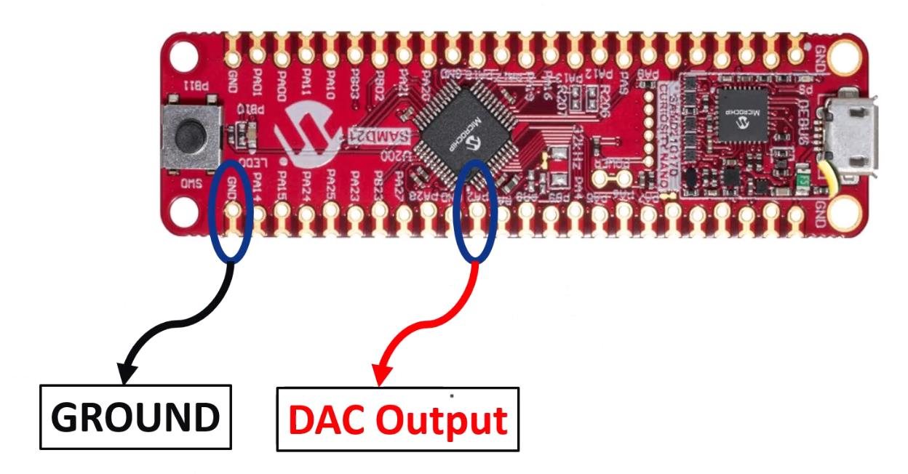
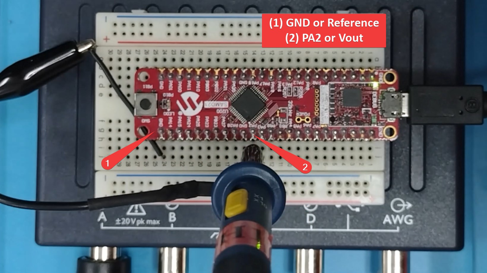

# DAC TIMER SET FREQUENCY

## Description
This project demonstrates how to configure the DAC (Digital to Analog Converter) peripheral of the ATSAMD21 to generate a sawtooth waveform with variable frequency.

## Software Used

The project was tested using the following software versions:

-   MPLABX IDE v6.05
-   Compiler: XC32 v4.0
- Packages:
	- SAMD21_DFP v3.6.144
	- CMSIS 5.8.0
   
## Setting up the Hardware

The example project was tested on the following target evaluation board:

- DM320119 SAM D21 CURIOSITY NANO EVALUATION KIT

To run the demo, the following additional hardware are required:

- Micro B USB cable
- PicoScope

### Configuring the Hardware

1. Tap the Picoscope probe to pin PA2 (Vout) and GND (Ground).

2. Connect the Curiosity Nano kit to the host computer using the micro B USB cable.

## Running the Application

1. Open the example project in MPLAB X and program the code to SAMD21 on the Curiosity Nano evaluation board.
2. Run a preferred terminal console to show the application splash screen.
3. Observe the sawtooth voltage output in the Picoscope.
4. Modify the period settings of Timer 3 to vary the frequency. Don't forget to generate and build the project before downloading the code onto the SAMD21 Curiosity Nano.

