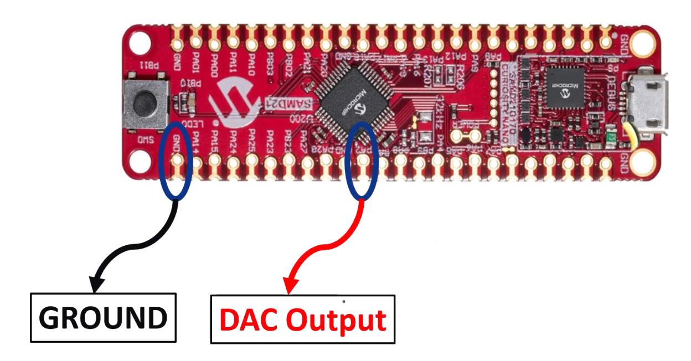

# DAC UART USER INPUT

## Description
This project demonstrates how to configure the DAC (Digital to Analog Converter) peripheral of the ATSAMD21.
The user can test the DAC conversion accuracy and correctness by entering an integer between 0 and 1023, and measuring the voltage generated.

## Software Used

The project was tested using the following software versions:

-   MPLABX IDE v6.05
-   Compiler: XC32 v4.0
- Packages:
	- SAMD21_DFP v3.6.144
	- CMSIS 5.8.0
   
## Setting up the Hardware

The example project was tested on the following target evaluation board:

- DM320119 SAM D21 CURIOSITY NANO EVALUATION KIT

To run the demo, the following additional hardware are required:

- Micro B USB cable
- PicoScope

### Configuring the Hardware

1. Tap the PicoScope probe to pin PA2 (Vout) and GND (Ground).

2. Connect the Curiosity Nano kit to the host computer using the micro B USB cable.

## Running the Application

1. Open the example project in MPLAB X and program the code to SAM D21 on the Curiosity Nano evaluation board.
2. In a connected serial terminal, enter an integer ranging from 0 to 1023.
3. Observe the changes of the output voltage in the PicoScope.

